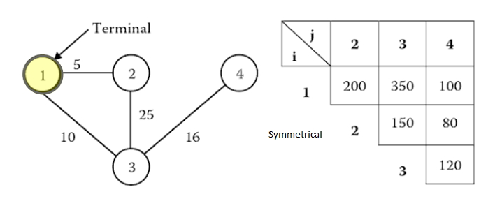

# Ceder1 Instance

This instance has one terminal node at Node ID 1, which means routes can only start from this node, but may end on other nodes before returning to terminal at node 1.



*Solutions:*
Two suggested possible solutions are:

```
ceder1 solution1
2
1-2
1-3-4

ceder1 solution2
3
1-2
1-3-4
1-3
```

While the first one minimizes average user generalized cost, the second one enables operation with lower fleet size as the extra 1-3 line will lower required frequency for route 1-3-4, thus reducing empty-space hours on the network.
