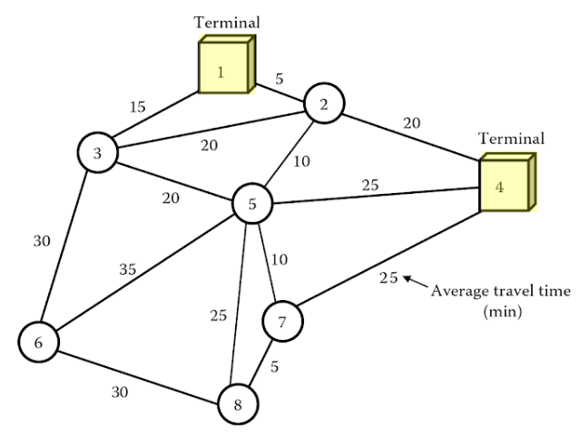
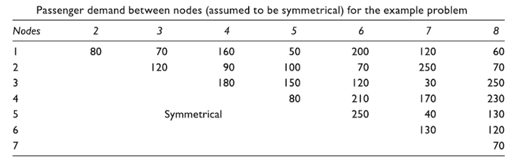

# Ceder 2

This instance has two terminal nodes, one at Node ID 1 and another at Node ID 4, which means routes can only start from those nodes, but may end on other nodes before returning the terminal.

*Solutions:*
