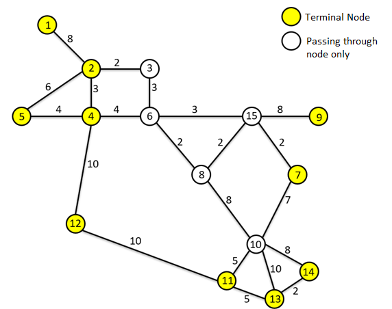

# Mandl2 Instance

This Mandl instance adaptation has only 10 nodes that can start routes. Other nodes must be passing nodes only.

*Solutions:*

A subset of solutions of Mandl1 applies to Mandl2. 

One of the advantages of restricting nodes to real-world conditions is that processing time is also reduced.
