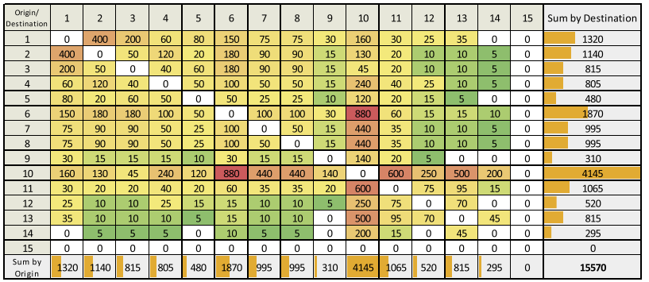
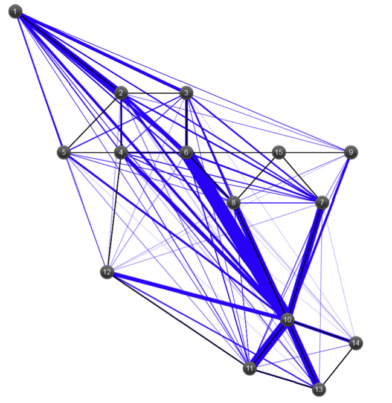

# Mandl Instances

| Network  	| Source                  	| Nodes 	| Links 	| Terminal Nodes 	|
|----------	|-------------------------	|-------	|-------	|----------------	|
| Mandl1   	| Mandl (1979)            	| 15    	| 21    	| All            	|
| Mandl2   	| Mandl (1979) adapted    	| 15    	| 21    	| 10             	|

Instances general comments:

Mandl instance is a very known instance in the field. It comprises 15 nodes and 21 links, with a symmetrical demand of 15.570 trips total. 

In this folder an additional instance is suggested for testing. Mandl2 is an adapted instance where only a subset of 10 nodes are terminal ones. Some nodes are then not allowed to start or end routes. This aims to represent real-world scenarios of congested central areas where only passing through lines are allowed and is proposed for testing methodologies that takes terminal locations into consideration.

Solutions are presented inside each instance folder.

Instance images:

The above mentioned visualizations were donated by Renato Arbex, as presented in Arbex and Cunha [(2015)](https://www.sciencedirect.com/science/article/pii/S0191261515001435)
