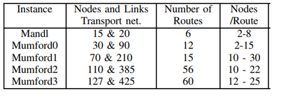

# Mumford Instances

| Network  	| Source                  	| Nodes 	| Links 	| Terminal Nodes 	|
|----------	|-------------------------	|-------	|-------	|----------------	|
| Mumford0 	| Mumford (2013)          	| 30    	| 90    	| All            	|
| Mumford1 	| Mumford (2013)          	| 70    	| 210   	| All            	|
| Mumford2 	| Mumford (2013)          	| 110   	| 385   	| All            	|
| Mumford3 	| Mumford (2013)          	| 127   	| 425   	| All            	|

Instances general comments:

Mumford suggests a fixed number of routes per instance and a range of number of routes per route.

TODO
  - Include proposed route sets for all instances (best and Pareto frontier)
  - Adapt Mumford2 and 3 to the proposed file format and insert here
