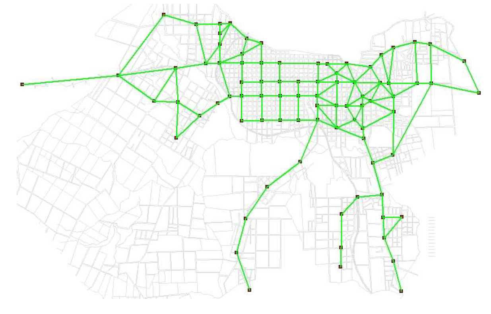

# Rivera Instances
| Network  	| Source                  	| Nodes 	| Links 	| Terminal Nodes 	|
|----------	|-------------------------	|-------	|-------	|----------------	|
| Rivera1  	| Mautonne (2005)         	| 84    	| 143   	| All            	|
| Rivera2  	| Mautonne (2005) adapted 	| 84    	| 143   	| 12             	|

Instances general comments:

Total demand in this instance is quite low.

Rivera instance node location was chosen after superposing the network with an aerial view, thus might bring some differences from real inicial locations.

A Rivera2 instance is proposed considering only a subset of possible terminal nodes.

Solutions will be presented inside each instance folder.

Instance image:

TODO
  - Gather solutions route sets and objective functions
  - Suggest relocating nodes based on better local knowledge
